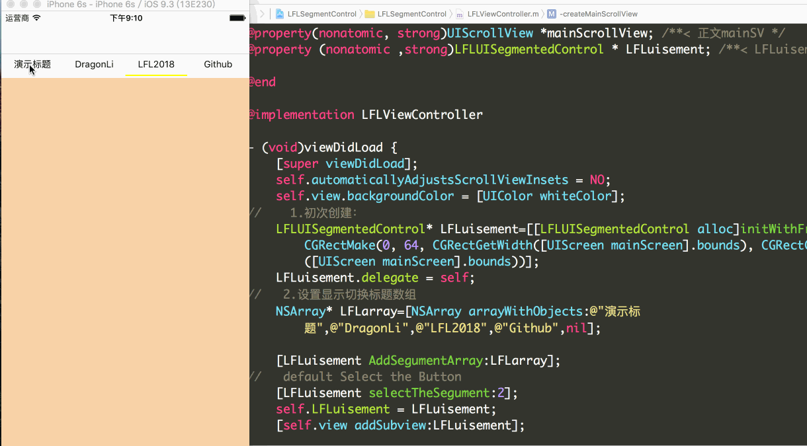

#LFLSegmentControl-最简单易用分段控件!
# 模仿网易新闻和搜狐新闻的首页效果，滑动切换不同栏目视图

- 2017- 04 - 07 pod update 3.0.0

- 2016- 06 - 25 优化创建控件代码,一句话即可! 
## 效果图


## 1. Installation 

###1.1   With [CocoaPods](http://cocoapods.org), add this line to your Podfile.

```
   pod 'SegmentControlLFL', '~> 3.0.0' 
  
   pod install

```

###1.2  也可以下载源码后把LFLUISegmentedControl文件夹直接拖入工程即可,可以clone下拖入工程使用即可.

##2.代码演示部分
```
   1.创建控件,建议高度37,其他数值,需要修改源码,适应居中标题view
   self.LFLuisement=[LFLUISegmentedControl segmentWithFrame:CGRectMake(0, 64,self_Width ,37) titleArray:@[@"演示标题",@"DragonLi",@"LFL2018",@"Github"] defaultSelect:0];
			// 非必须设置属性
    /*
   2, 自定义各类颜色 和 字体大小
    [self.LFLuisement titleColor:[UIColor greenColor] selectTitleColor:[UIColor redColor] BackGroundColor:[UIColor grayColor] titleFontSize:13];
   3. 设置下滑线颜色 .默认为主流的红色
    [self.LFLuisement lineColor:[UIColor brownColor]];
   */
    self.LFLuisement.delegate = self;
    [self.view addSubview:self.LFLuisement];

#pragma mark ---LFLUISegmentedControlDelegate
/**
*  点击标题按钮
*
*  @param selection 对应下标 begain 0
*/
-(void)uisegumentSelectionChange:(NSInteger)selection{
//    可以根据选中下标执行不同操作,详见demo
}

```

Requirements
==============
This library requires `iOS 6.0+` and `Xcode 6.0+`.

# 3. 有任何问题，请及时 issues me `dragonli_52171@163.com`

# 4. 已知问题,如果分段数组大于6个,因为没有采取滚动视图承载,可能会有显示问题,修改下源码即可.但是对于一般简单标题需求可完美使用.

 

